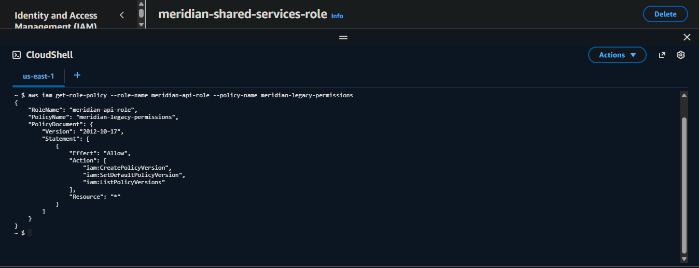
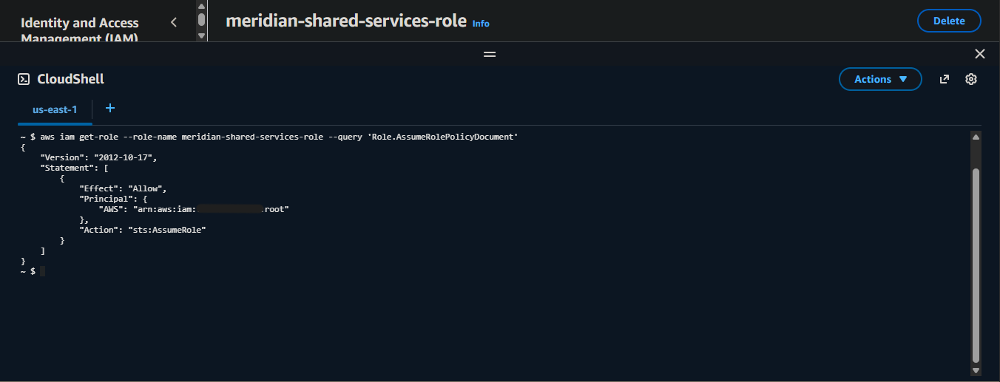
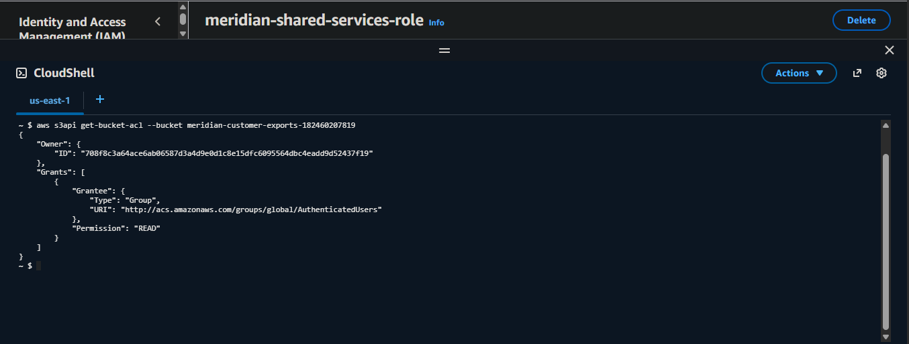

# Zero-to-Decrypt

> A black-box assessment of a realistic small-company AWS environment — tracing one continuous path from a public EC2 instance to decrypted customer data, not four unrelated findings.

## Overview

This repository documents the Week 14 capstone of the AWS Cloud Security Engineering Roadmap: a self-directed, black-box security assessment of a deliberately misconfigured AWS environment simulating a small SaaS company, Meridian Metrics. No findings, vulnerability categories, or hints were provided going in — only a scope document listing the in-scope resources by name and ID, the same way a real engagement's rules-of-engagement document would.

The assessment surfaced six findings across IAM, S3, networking, and KMS. But the real result isn't the count — it's that four of those six findings aren't independent problems. They chain. A publicly reachable EC2 instance holds an IAM role with an unrestricted policy-versioning permission, which is enough to self-grant a path into a second role with a dangerously permissive trust policy, which holds decrypt access to a KMS-protected S3 bucket. Read in isolation, each finding looks moderate. Read as a chain, it's a complete path from internet-facing compromise to decrypted data exfiltration — which is the actual lesson of this exercise: a checklist of findings and a real assessment are not the same deliverable.

## Architecture — The Attack Path

```
                              INTERNET
                                 │
                                 ▼
                    ┌─────────────────────────┐
                    │  meridian-api-sg          │
                    │  Inbound: 443, 5432        │
                    │  from 0.0.0.0/0             │
                    └────────────┬────────────┘
                                 ▼
                    ┌─────────────────────────┐
                    │  meridian-api-prod-01     │
                    │  EC2, public subnet,       │
                    │  public IPv4                │
                    │  No SSM management path      │
                    └────────────┬────────────┘
                                 │ assumes
                                 ▼
                    ┌─────────────────────────┐
                    │  meridian-api-role         │
                    │  meridian-legacy-permissions│
                    │  iam:CreatePolicyVersion     │
                    │  iam:SetDefaultPolicyVersion │
                    │  Resource: *                  │
                    └────────────┬────────────┘
                                 │ self-grants sts:AssumeRole
                                 ▼
                    ┌─────────────────────────┐
                    │  meridian-shared-services-  │
                    │  role                         │
                    │  Trust policy: account root    │
                    │  principal — assumable by ANY  │
                    │  identity in the account         │
                    └────────────┬────────────┘
                                 │ holds kms:Decrypt + s3:GetObject
                                 ▼
                    ┌─────────────────────────┐
                    │  meridian-data-key (KMS)    │
                    │       +                        │
                    │  meridian-customer-exports    │
                    │  (S3 — also independently        │
                    │  readable via ACL grant to        │
                    │  AuthenticatedUsers, a second,     │
                    │  parallel exposure path)             │
                    └─────────────────────────┘
                                 ▼
                          DECRYPTED CUSTOMER DATA
```

## Findings

| # | Finding | Severity |
|---|---|---|
| 1 | Security group permits unrestricted inbound access on ports 443 and 5432 | Critical |
| 2 | `meridian-api-role` holds unrestricted IAM policy-versioning permissions (privilege escalation primitive) | Critical |
| 3 | `meridian-shared-services-role` trust policy permits assumption by any principal in the account | Critical |
| 4 | S3 bucket ACL grants read access to the `AuthenticatedUsers` group | High |
| 5 | S3 bucket versioning disabled | Medium |
| 6 | EC2 instance has no SSM-based remote management path configured | Medium |

### Finding 1 — Unrestricted Security Group Ingress

`meridian-api-sg` permits inbound traffic on port 5432 (PostgreSQL) and port 443 from `0.0.0.0/0`, attached to a public-subnet, public-IP EC2 instance. This finding stands on its own regardless of what's actually running behind the port — unnecessary exposure is the risk, not a hypothetical service assumed to be listening on it.

### Finding 2 — IAM Privilege Escalation via Unrestricted Policy Versioning

```bash
aws iam get-role-policy --role-name meridian-api-role --policy-name meridian-legacy-permissions
```

`meridian-api-role` — attached to the public-facing EC2 instance above — holds `iam:CreatePolicyVersion` and `iam:SetDefaultPolicyVersion` scoped to `Resource: *`. This is a documented IAM privilege escalation primitive: any identity holding these permissions can create a new default version of any policy it can already reach, effectively self-granting arbitrary additional permissions. Combined with Finding 1, a compromise of the public EC2 instance inherits this escalation path directly through instance metadata credentials.



### Finding 3 — Overly Permissive Trust Policy on a Second Role

```bash
aws iam get-role --role-name meridian-shared-services-role --query 'Role.AssumeRolePolicyDocument'
```

`meridian-shared-services-role`'s trust policy specifies the account root ARN as its principal rather than a specific role or service — meaning any identity in the account holding `sts:AssumeRole` permission can assume it, not just its intended caller. This role independently holds `kms:Decrypt` on `meridian-data-key` and read access to the customer exports bucket. Combined with Finding 2, an identity starting with zero assume-role rights can self-grant them via policy version manipulation, then assume this role directly.



### Finding 4 — S3 Bucket ACL Grants Read to AuthenticatedUsers

```bash
aws s3api get-bucket-acl --bucket meridian-customer-exports-182460207819
```

The bucket's ACL grants read access to the predefined `AuthenticatedUsers` group — any authenticated AWS identity in any account, not just this one. This exposure exists independent of the escalation chain above; it does not require compromising the EC2 instance at all, only possession of any valid AWS account. Severity assessed as High rather than Critical because the bucket's contents are also KMS-encrypted — read access alone yields ciphertext, not usable data, without a corresponding decrypt path (which Finding 3 separately provides). Block Public Access settings on this bucket permit ACL-based grants to take effect, which is what allowed this configuration to exist at all.



### Finding 5 — S3 Versioning Disabled

`meridian-customer-exports-182460207819` has no versioning configuration. In combination with the write access granted via Finding 2's chain, this means an object overwrite or deletion along the escalation path would be unrecoverable — no version history to restore from.

### Finding 6 — No SSM Management Path

`meridian-api-role` holds no SSM-related permissions, and the instance has no way to be reached for management without a network-based path. This is an operational gap rather than a direct exposure — it does not itself grant access to an attacker, but it removes the operator's ability to investigate or respond to the instance without first opening a new access path, which would need to be provisioned carefully rather than reactively under incident pressure.

## Isolated Findings vs. the Chained Attack Path — The Complete Assessment Model

```
        FOUR FINDINGS, READ SEPARATELY           THE SAME FOUR FINDINGS, CHAINED
    ┌────────────────────────────────┐    ┌────────────────────────────────┐
    │  SG exposes two ports            │    │  Public entry point established │
    │  Role has odd IAM permissions      │    │  → self-escalation primitive     │
    │  Second role has a broad principal   │    │  → reachable via the escalation  │
    │  Bucket ACL grants wide read           │    │  → parallel + chained data path  │
    │                                          │    │                                     │
    │  Reads as: four moderate,                │    │  Reads as: one complete path from │
    │  unrelated hardening items                │    │  internet-facing compromise to     │
    │                                              │    │  decrypted data exfiltration        │
    └────────────────────────────────┘    └────────────────────────────────┘
              Same environment. Same four findings. Different conclusion
                    depending on whether they were chained or not.
```

## Key Conceptual Anchors

- **A finding describes present, verifiable configuration — not predicted future behavior.** "This could lead to someone opening SSH later" is speculation, not a finding; "there is currently no management path" is.
- **`kms list-grants` and a key's own policy do not tell you who can actually use a key.** Real-world KMS access overwhelmingly flows through IAM-policy-based permissions on the key ARN, not the grants mechanism — checking grants alone and concluding "no one has access" is a methodology error, not a finding.
- **Bucket policies, Block Public Access settings, and bucket ACLs are three independent mechanisms.** A bucket can pass every bucket-policy and BPA-based automated check and still be exposed through its ACL — which most tooling and most manual reviews skip because ACLs are treated as legacy and assumed unused.
- **An account-root principal in a trust policy is not equivalent to "restricted to legitimate callers."** It means "any identity in this account with `sts:AssumeRole` rights" — a meaningfully larger blast radius than the role's owner likely intended.
- **Unnecessary exposure is the finding, independent of what's confirmed to be listening behind it.** Don't weaken a network-exposure finding by speculating about what service might be running — the absence of restriction is the risk on its own.

## AWS Services Used

- **Amazon EC2** — the environment's public-facing entry point and the origin of the escalation chain.
- **AWS IAM** — roles, inline policies, and trust policies; both the escalation primitive and the second role's exposure live entirely at this layer.
- **AWS KMS** — customer-managed encryption key; the actual decrypt-capable identity was determined via IAM policy cross-reference, not the key's own policy or grants.
- **Amazon S3** — object storage with a parallel, independent exposure path via bucket ACL, separate from the IAM-based chain.
- **Amazon VPC** — the network boundary defining what's reachable from the internet in the first place.

## Part of the AWS Cloud Security Roadmap

| Week | Focus |
|---|---|
| Week 1 | Cloud computing fundamentals & the shared responsibility model |
| Week 2 | Cloud networking — VPCs, subnets, CIDR, security groups |
| Week 3 | IAM deep dive — users, roles, policies, least privilege |
| Week 4 | Cloud storage — S3, EBS, EFS, versioning, encryption at rest |
| Week 5 | EC2 deployment & hardening (SSM Session Manager only, no public SSH) |
| Week 6 | VPC deep dive — secure 3-tier architecture |
| Week 7 | CloudTrail, CloudWatch, Config fundamentals |
| Week 8 | GuardDuty, Security Hub, Inspector — first IR runbook |
| Week 9 | IAM security deep dive — privilege escalation paths |
| Week 10 | Network security — WAF, Shield, VPC Flow Logs |
| Week 11 | Data protection — KMS, S3 security audit, Macie |
| Week 12 | Threat detection & incident response — GuardDuty/CloudTrail correlation |
| Week 13 | Cloud vulnerability assessment — Inspector, CSPM, CIS Benchmark, Config rules |
| **Week 14** | **Compliance frameworks & capstone — black-box assessment of a simulated environment (this repository). Final AWS-only week; Phase 4 certification sprint follows.** |

---

*Part of Geoffrey Muriuki Mwangi's AWS Cloud Security Engineering Roadmap — built in public, documented in full.*
